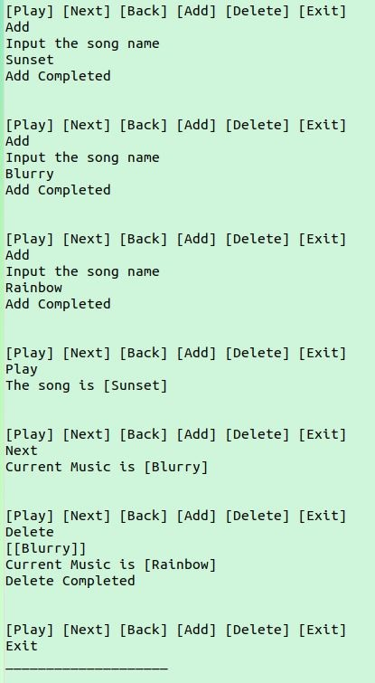

# Music Player

## Function
Function Name | Description
---- | ----  

**Play**    | Print current data  
**Next**    | Move next music  
**Back**    | Move back music  
**Add Music**    | Add new music   
**Delete Music**    | Delete current music  
**Circular**    | If use the Next function with last music, move to first music

* Add Music 을 했을 때, 현재 위치를 저장해주는 currentPointer의 값이 변하지 않아야 한다.
* Delete Music 을 했을 때, 현재 위치의 노드를 삭제하고 그 다음노드로 currentPointer를 옮겨준다.  

 

# ScreenShot  

